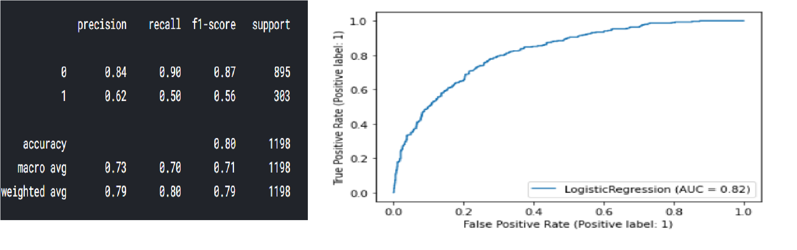
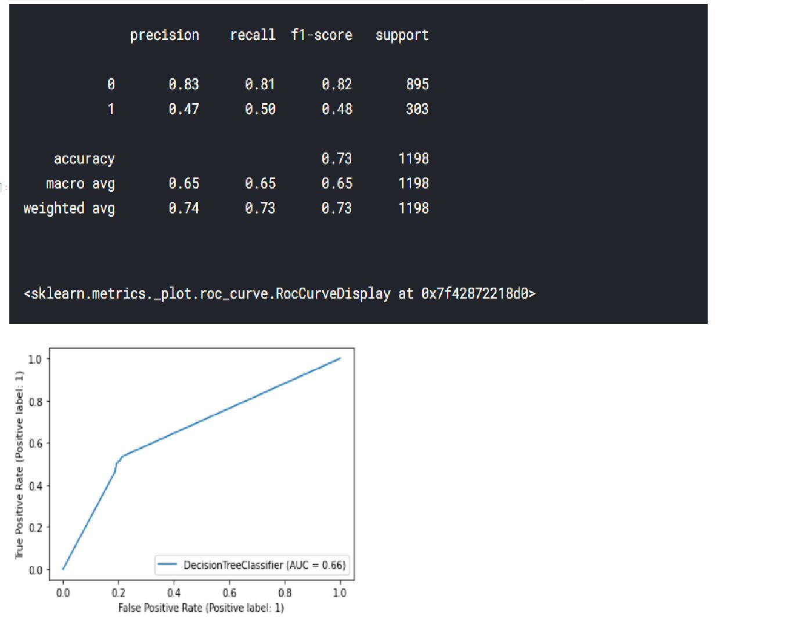
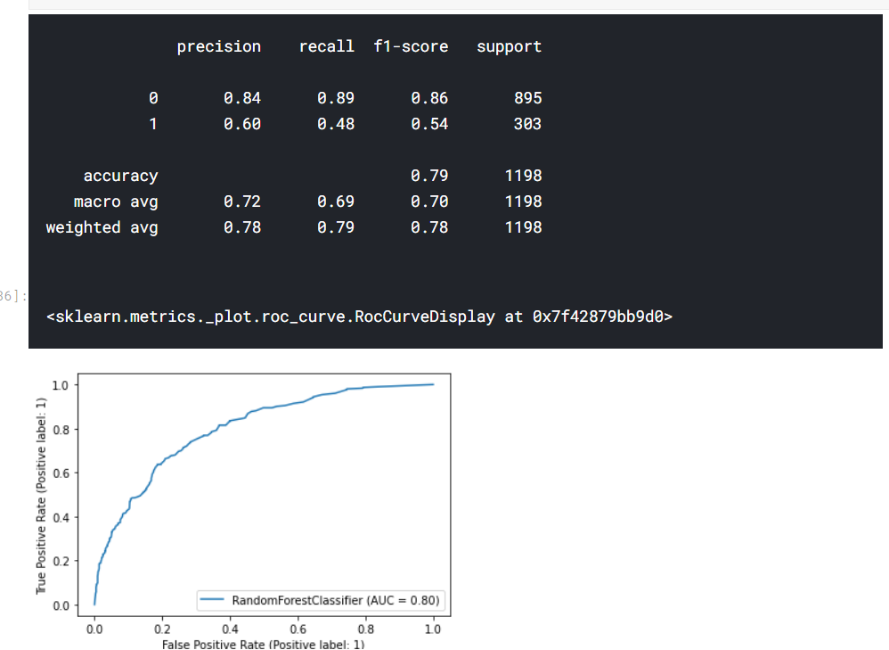
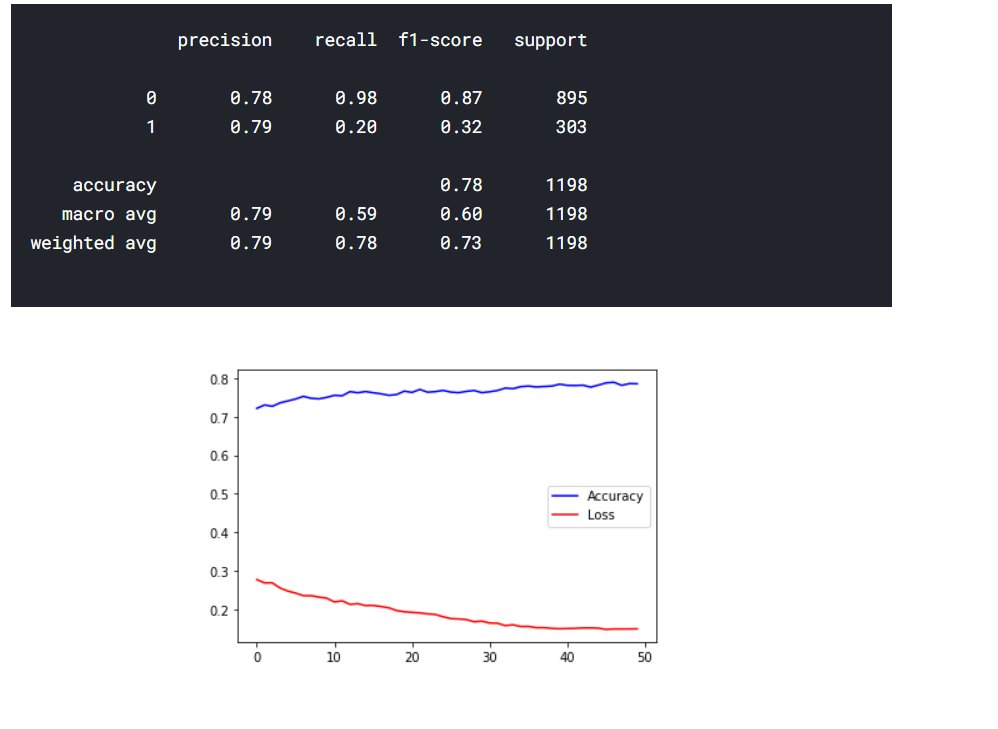

## This is a CHURN dataset for Telecom Industry  
**The task is to analyze the data and predict the churn of users (to identify people who will and will not renew their contract).** 
### About the Notebook  
- Firstly i did some data preprocessing that is remove useless columns such as customerID 
- Then Encoding all the categorical variables then changing all string columns to int 
- then we have some EDA of various columns with following **observations**: 
#### Having a partner or not having a partner does not effect the monthly charges that much, the effect is very minimal. 
#### Contract year effects monthly costs. The contract with the most length has the lowest prices because of the commitment of the customer. 
#### Senior citizens pays more than non senior citizens. That might be because younger people use more internet so their contracts have more throughput. 
#### Fiber optic is the fastest and most reliable internet right now. It is not surprise that it is the most expensive one. 

- Choose coluns on the basis of correlation value w.r.t. to CHURN column
- Splitting the dataset

## Model Used:
- Logictic Regression 
 
- Decision Tree 
 
- Random Forests 
 
- ANN 
 

#### We achieved around %80 accuracy with different models. If we do some feature engineering after the preprocess maybe we can increase the accuracy little bit more.
